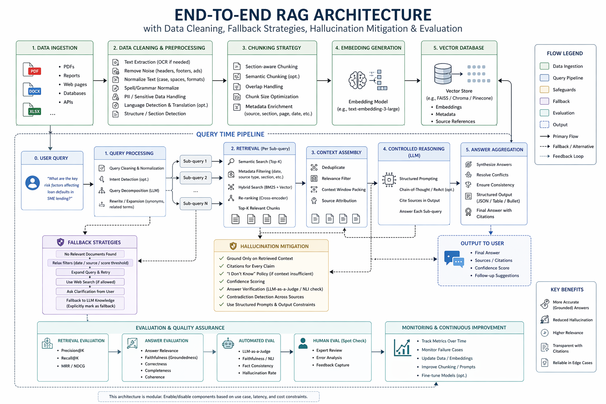

# 📊 Financial Report RAG QA System

A production-oriented Retrieval-Augmented Generation (RAG) application that extracts insights from financial reports (PDFs) and answers user queries using LLMs.

---

## 🚀 Overview

This project implements an **end-to-end RAG pipeline** with:

* 📄 Data ingestion & cleaning (PDFs, reports)
* ✂️ Section-aware chunking & embeddings
* 🔎 Semantic retrieval using FAISS
* 🧠 Controlled reasoning pipeline (query decomposition + aggregation)
* 🛡️ Hallucination mitigation & fallback strategies
* 📊 Evaluation (precision@k, relevance, groundedness)
* 🌐 Streamlit UI + FastAPI backend
* ☁️ Deployment on Vertex AI with Docker

---

## 🏗️ Architecture



### 🔍 Pipeline Breakdown

**Ingestion Pipeline**

* Extract text from PDFs
* Clean & normalize content
* Section-aware chunking with overlap
* Generate embeddings
* Store in FAISS with metadata

**Query Pipeline**

1. Query preprocessing & decomposition
2. Targeted retrieval per sub-query
3. Controlled reasoning via LLM
4. Answer aggregation & structuring
5. Final grounded response

**Evaluation Layer**

* Retrieval: Precision@k
* Generation: Relevance, groundedness
* Continuous feedback loop

---

## 🧠 Key Design Decisions

* **Section-aware chunking** → improves retrieval precision
* **Query decomposition** → handles complex financial queries
* **Controlled reasoning** → reduces hallucinations
* **Fallback strategies** → ensures robustness on low-confidence retrieval
* **Evaluation-first design** → measurable improvements over baseline

---

## 🛡️ Hallucination Mitigation

* Context-constrained prompting
* Source attribution (traceable outputs)
* Confidence thresholds for retrieval
* Answer refusal when context is insufficient
* Structured reasoning instead of free-form generation

---

## 🔁 Fallback Strategies

* Low-relevance retrieval → retry with expanded query
* No context found → return “insufficient information”
* Conflicting answers → rank & reconcile
* Timeout/LLM failure → cached or simplified response

---

## ⚙️ Tech Stack

| Layer      | Technology                     |
| ---------- | ------------------------------ |
| Frontend   | Streamlit                      |
| Backend    | FastAPI                        |
| LLM        | OpenAI / Vertex AI             |
| Embeddings | OpenAI / Sentence Transformers |
| Vector DB  | FAISS                          |
| Evaluation | RAGAS                          |
| Deployment | Vertex AI                      |
| Container  | Docker                         |

---

## 📁 Project Structure

```
/rag-finance-app
  /assets
    rag_architecture.png
  /input
  /output
  /src
    /evaluation
      feedback.py
      metrics.py
    /ingestion
      db_connection.py
      db_manager.py
      indexing.py
      parsing.py
    /reasoning
      processor.py
      retrieval.py
  app.py
  main.py
  config.yaml
  requirements.txt
  README.md
```

---

## ▶️ Getting Started

### 1. Clone Repo

```bash
git clone <your-repo>
cd rag-finance-app
```

### 2. Create Environment

```bash
python -m venv virtual
virtual\Scripts\activate   # Windows
```

### 3. Install Dependencies

```bash
pip install -r requirements.txt
```

### 4. Set Environment Variables

```bash
OPENAI_API_KEY=your_key
```

### 5. Run Backend (FastAPI)

```bash
uvicorn main:app --reload
```

### 6. Run Frontend (Streamlit)

```bash
streamlit run frontend/app.py
```

---

## 🐳 Docker Setup

### Build Image

```bash
docker build -t rag-finance-app .
```

### Run Container

```bash
docker run -p 8000:8000 rag-finance-app
```

---

## ☁️ Deployment (Vertex AI)

* Containerize application using Docker
* Push image to Google Artifact Registry
* Deploy via Vertex AI endpoint
* Enable autoscaling and monitoring

---

## 📊 Evaluation Results (Example)

| Metric        | Baseline RAG | Enhanced RAG |
| ------------- | ------------ | ------------ |
| Precision@5   |    |        |
| Relevance     |      |          |
| Hallucination |    |      |

---

## ⚖️ Tradeoffs

| Aspect   | Impact                        |
| -------- | ----------------------------- |
| Accuracy | ↑ improved                    |
| Latency  | ↑ slightly higher             |
| Cost     | ↑ due to multi-step reasoning |

---

## 🎯 Future Improvements

* Hybrid retrieval (BM25 + vector)
* Re-ranking models
* Streaming responses
* Fine-tuned domain models

---

## 🧾 License

MIT License

---

## 🙌 Acknowledgements

Inspired by recent research in RAG optimization and LLM reasoning pipelines.